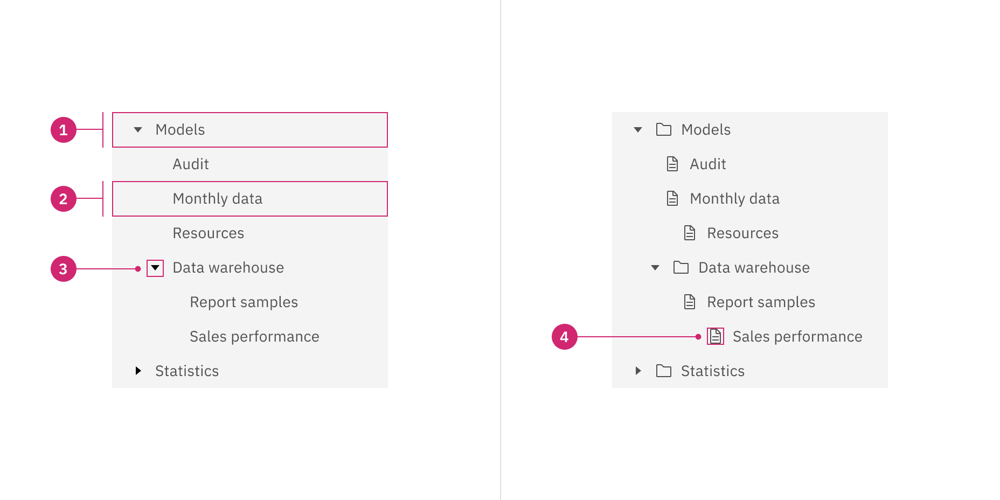

# UI-Design

## Prüfungsstoff

1. **Accordion**:
   - **Verwendung**: Häufig verwendet, um Informationen in einer hierarchischen Struktur, wie FAQs oder Menüs, anzuzeigen.
   - **Interaktion**: Benutzer klicken auf den Header, um den Inhalt aus- oder einzuklappen.
   - **Anpassung**: Kann horizontal oder vertikal angeordnet sein, je nach Design-Anforderungen.

2. **"Multi"select**:
   - **Verwendung**: Ideal für Formulare oder Listen, in denen Benutzer mehrere Optionen gleichzeitig auswählen können.
   - **Interaktion**: Benutzer klicken auf die Optionen oder verwenden Tastenkombinationen, um Auswahl(en) hinzuzufügen oder zu entfernen.
   - **Erweiterungen**: Kann mit Suchfunktionen und Filtern kombiniert werden, um die Auswahl zu erleichtern.

3. **Date Picker**:
   - **Verwendung**: Wird verwendet, um Benutzern die Auswahl von Datum und/oder Uhrzeit in einer benutzerfreundlichen Weise zu ermöglichen.
   - **Interaktion**: Benutzer können das Datum im Kalender auswählen oder manuell eingeben.
   - **Kalender-Typen**: Einzel- oder Mehrfachauswahl, Datumsbereichsauswahl.

4. **Autocomplete**:
   - **Verwendung**: Hilft Benutzern beim schnellen Ausfüllen von Textfeldern, indem es Vorschläge basierend auf dem eingegebenen Text anzeigt.
   - **Interaktion**: Benutzer können aus den vorgeschlagenen Optionen auswählen oder den Text weiter eingeben.
   - **Effizienz**: Verbessert die Benutzererfahrung, besonders in Such- und Eingabeformularen.

5. **Slider**:
   - **Verwendung**: Erlaubt es Benutzern, Werte aus einem festgelegten Bereich auszuwählen, indem sie einen Schieberegler bewegen.
   - **Interaktion**: Benutzer ziehen den Schieberegler horizontal oder vertikal, um den Wert anzupassen.
   - **Anpassung**: Kann für verschiedene Datentypen wie Zahlen, Prozentwerte oder Farbauswahl verwendet werden.

6. **Progress Bar**:
   - **Verwendung**: Zeigt den Fortschritt einer laufenden Aktion an, z.B. das Hochladen einer Datei oder das Abschließen eines Vorgangs.
   - **Interaktion**: In der Regel statisch und nur zur Anzeige des Fortschritts, nicht zur Interaktion durch Benutzer.
   
 

7. **Carousel/Slideshow**:
   - **Verwendung**: Ermöglicht die Präsentation von Bildern oder Inhalten in einer sich automatisch oder manuell bewegenden Diashow.
   - **Interaktion**: Benutzer können zwischen den Inhalten vorwärts oder rückwärts navigieren oder die automatische Wiedergabe steuern.

8. **Rating**:
   - **Verwendung**: Gestattet Benutzern das Bewerten von Produkten, Dienstleistungen oder Inhalten durch Auswahl von Sternen oder anderen Symbolen.
   - **Interaktion**: Benutzer klicken auf die gewünschte Anzahl von Sternen, um ihre Bewertung abzugeben.
   - **Varianten**: Kann auch mit Kommentarfeldern für detaillierte Bewertungen kombiniert werden.

9. **Treeview**:
   - **Verwendung**: Ideal für die Darstellung und Navigation von hierarchischen Strukturen wie Dateiverzeichnissen oder Organigrammen.
   - **Interaktion**: Benutzer können Knoten erweitern oder minimieren, um untergeordnete Elemente anzuzeigen oder zu verbergen.
   - **Komplexität**: Kann bei großen Strukturen mit Such- und Filterfunktionen erweitert werden, um die Navigation zu erleichtern.

