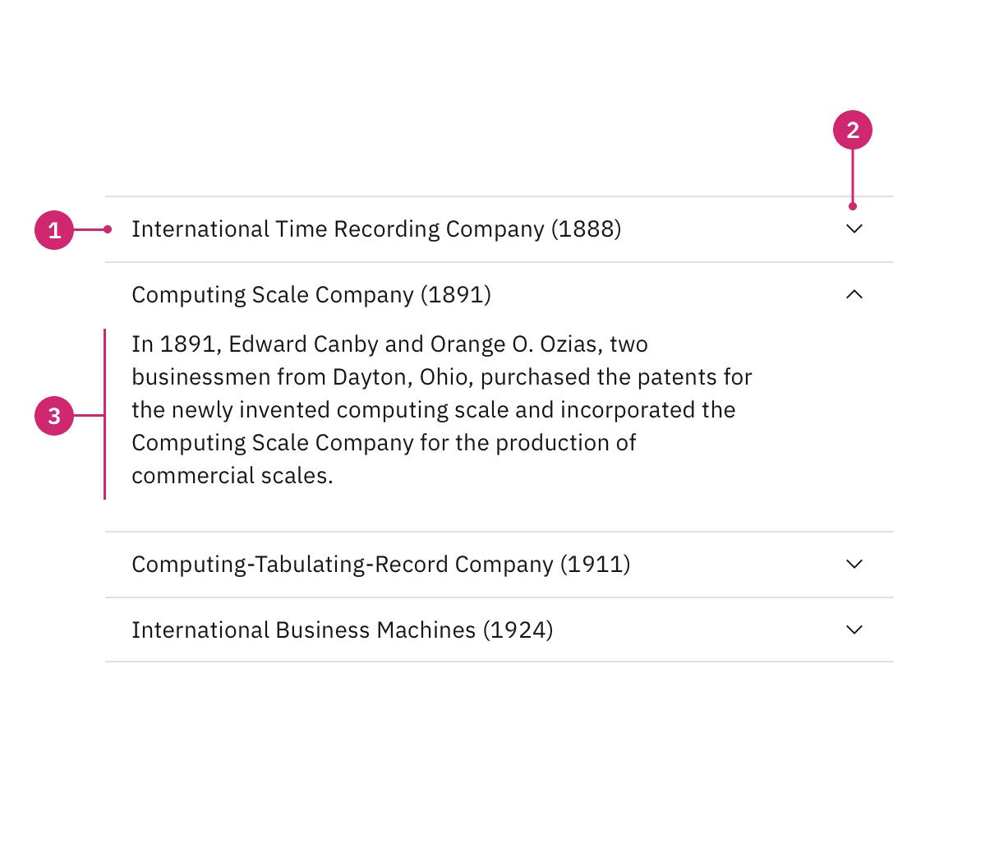
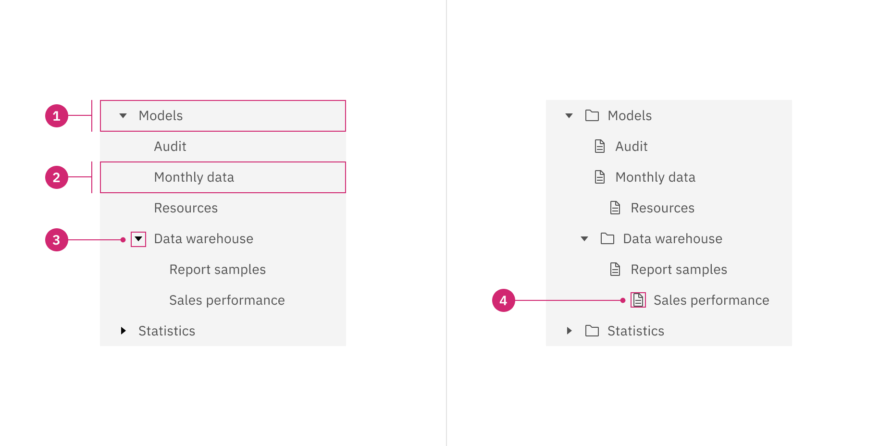

# Workshop - UI-Design

## Accordion

In web design, an accordion is a type of menu that displays a list of headers stacked on top of one another. When clicked on (or triggered by a keyboard interaction or screen reader), these headers will either reveal or hide associated content.
### Components

Accordions usually consist of a header, an icon and the folded out panel.
#### Header

The header contains a Title which describes the content of the Accordion. We want to know what to expect when we fold out the accordion.
#### Icon

The Icon indicates what the user has to click to make the accordion fold out and back in. Different symbols are used but most often either an arrow or a plus is used.
#### Panel

The panel is the folded out Accordion, containing content associated with the title in the Header.
### Format

1. Header
2. Icon
3. Panel
### When to use:

- To organize related information.
- To shorten pages and reduce scrolling when content is not crucial to read in full.
- When space is at a premium and long content cannot be displayed all at once, like on a mobile interface or in a side panel.
## Tree view

A tree view consists of nested heading levels that create a content hierarchy for users and assist with navigating large amounts of information.
### Components

#### Parent nodes / Branch nodes

The top level Entries in the tree structure. Can be expanded to show child nodes.
#### Child nodes 

Nodes that are nested inside of a parent / branch node. They can be leaf nodes or parent nodes. Either they contain  a leaf node / more nested components or they are a leaf.
#### Leaf nodes

Leaf nodes are nodes that can not be further expanded. We've reached the tip and there is a leaf. No further branches
#### Expand icon

Icon that can be clicked to expand or collapse a node.

1. Parent node
2. Leaf node
3. Expand icon

### When to use:

- Often used for navigating file system structures that are made up of folders and documents.
- To organize large amounts of information that can nest within multiple levels.

### When not to use:

- To show and hide UI elements or content on a page.
- When you only need one level of nested information. In this case, use a different component like the [accordion](https://carbondesignsystem.com/components/accordion/usage/) or [data table](https://carbondesignsystem.com/components/data-table/usage/) for expandable views that go one level deep.
- As the primary navigation in a product’s UI. Instead, use the UI Shell left panel for product navigation. A combination of the [UI shell left panel](https://carbondesignsystem.com/components/UI-shell-left-panel/usage/) and the [breadcrumb](https://carbondesignsystem.com/components/breadcrumb/usage/)component can support an information architecture several levels deep.